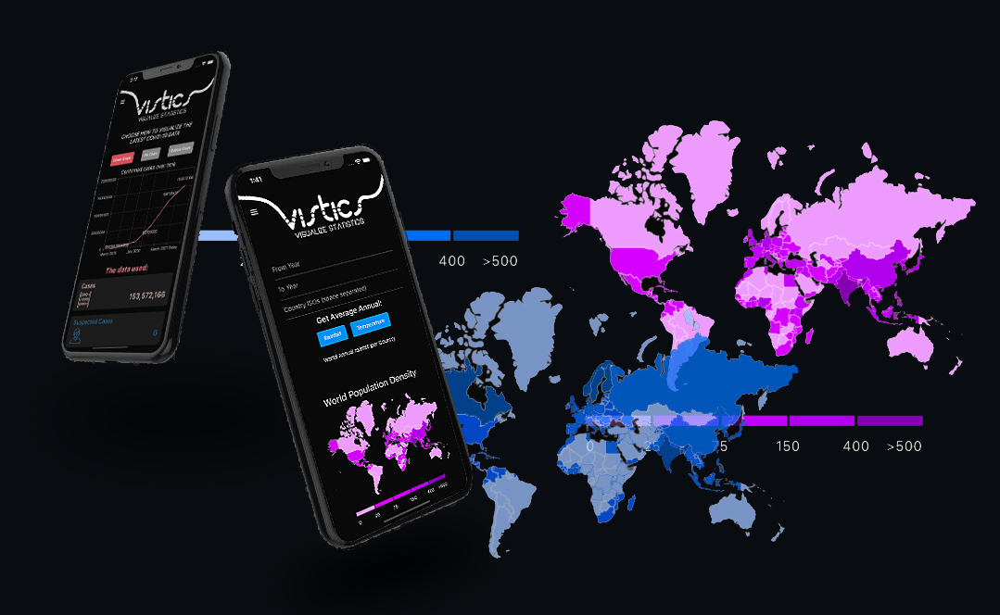
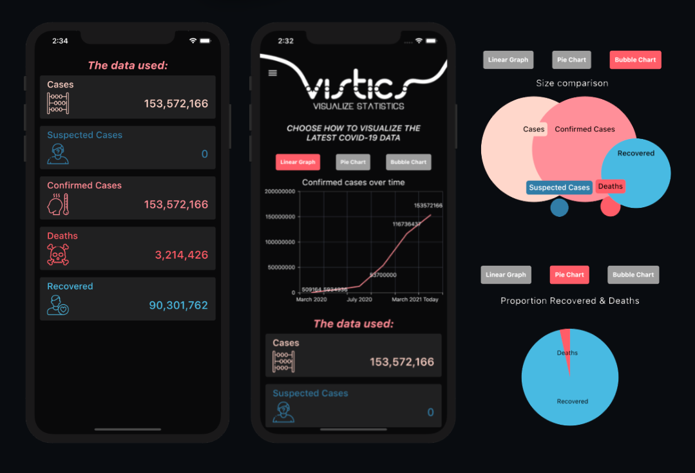
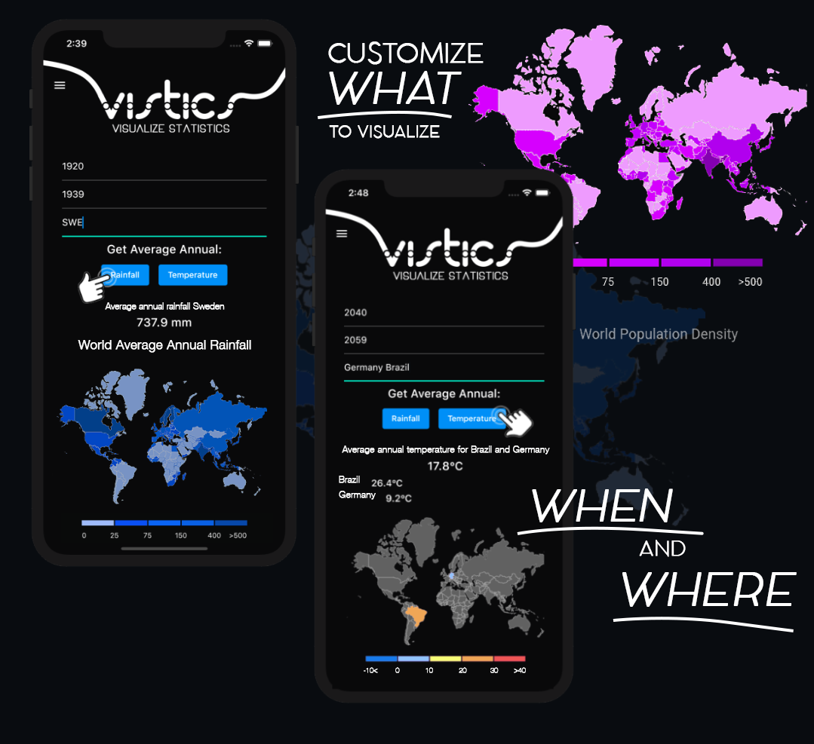

*Vistics - Visualize Statistic* is a Flutter mobile app that visualizes different types of data. The app is built in Dart, and uses to different REST APIs. 

This app is not a part of any university course or previous work, just something I've worked with on my space time, because I think datavisualization is really interesting.

The first REST API connectet to the app is the *nCov 2019 Coronavirus API*. The user can choose to visualize the data in severaal different ways with the click of a button, or scroll down to see the data lined upp in a list view. To update the numbers, the user simply uses pull-to-refresh, and a new API call is made. 

The second REST API connected to the app is the *Climate Data API* from *The World Bank*. Through this API we wan get data on several different cathegories, such as temperature and rainfall. The user can through a form choose for what time and which countries to retrieve data from. The years can be information about years back in time, or predicions for future years, all the way to 2099. 

All graphs and maps are displayed with the Flutter widgets **Syncfusion Graphs** and **Syncfusion Maps**. 

### Run this app on your device:
When cloning this project, please note that the following files are not included:
- .vscode/settings.json
- lib/app/services/api_keys.dart

You can create your own API key for free at [http://ncov2019-admin.firebaseapp.com/](http://ncov2019-admin.firebaseapp.com/). 
